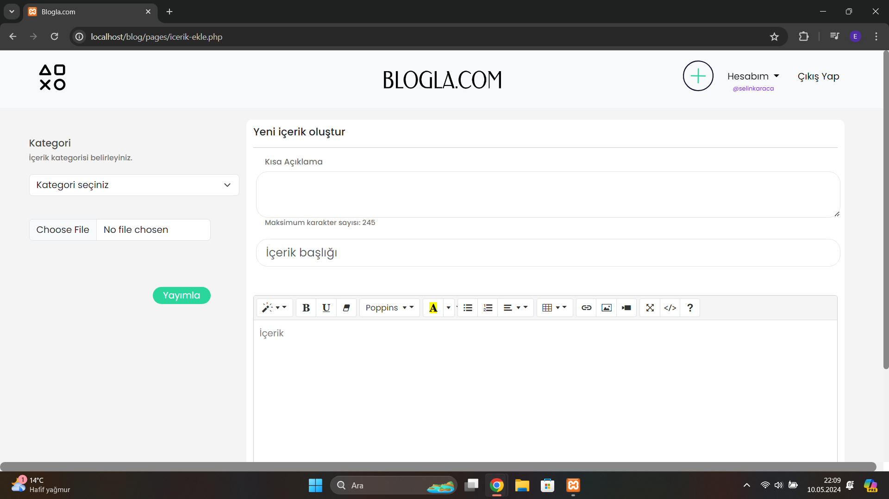

# Yönetici Panelli Blog Sitesi
Kullanılan teknolojiler: PHP, MySQL, HTML, CSS, JavaScript, Boostarp

Özellikler: Kullanıcı üyeliği oluşturma, üyelik bilgilerini güncelleme, hesap silme, blog içeriği ekleme, diğer kullanıcı profillerini görüntüleme, yönetici tarafından blog içeriklerinin ve kullanıcılarının kaldırılması

***

Kullanıcılar, ekledikleri blog içeriğini düzenleme ve silme işlemlerini gerçekleştirebilirler. Ayrıca ad, soyad, kullanıcı adı, e-posta, şifre ve profil fotoğrafı gibi kişisel bilgilerini güncelleyebilirler.
Yönetici giriş yaptığında, toplam yayınlanan blog sayısını ve kayıtlı kullanıcı sayısını görebilir. Ayrıca kullanıcı hesaplarını ve blogları silebilir, blog kategorilerini düzenleyebilir.

## Görüntüler

